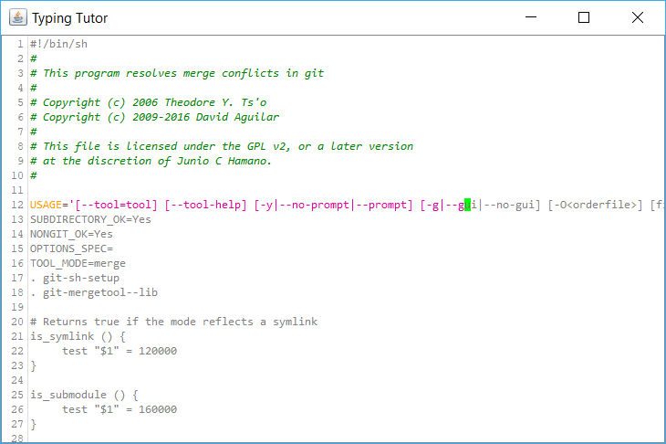

# Typing Tutor

[](https://travis-ci.com/rgoulter/scala-typingtutor)
[](https://coveralls.io/github/rgoulter/scala-typingtutor?branch=master)

A typing tutor inspired by [typing.io](https://typing.io),
a typing tutor which uses syntax-highlighted source code for typing practice.

This project uses
[RSyntaxTextArea](https://github.com/bobbylight/RSyntaxTextArea) for
syntax highlighting, and [Sodium FRP](https://github.com/SodiumFRP/sodium).



## Building

Requirements:

- JDK 8,
  as recommended by:
  https://docs.scala-lang.org/overviews/jdk-compatibility/overview.html

- SBT https://www.scala-sbt.org/1.0/docs/Setup.html
  - see also: https://github.com/paulp/sbt-extras

The FRP library Sodium is used as a sub-project dependency, and is
included in this repo as a sub-repository.  
Please update submodules with a command such as:

``` bash
git submodules update --init --recursive
```

This project's uses Scala Built Tool (SBT) for its build.
It's typically easiest to run `sbt` as a shell, but it can
also be invoked from the command line with tasks such as:

* compiling can be done using `sbt compile`; the program can be run using
  `sbt run`.

* tests can be run with `sbt cucumber`.

* a JAR can be produced using `sbt packageBin`.

* documentation can be produced using `sbt doc`.

For other tasks SBT can do, see `sbt tasks`. These commands should be called
from the commandline in the root directory of the project. (The tasks can also
be run in the SBT shell, by running `sbt` then calling the tasks from that).
